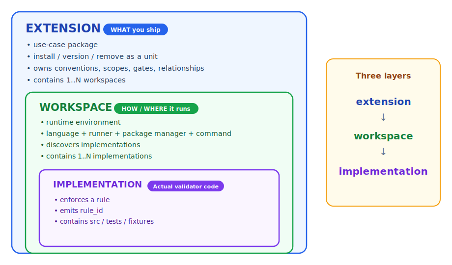
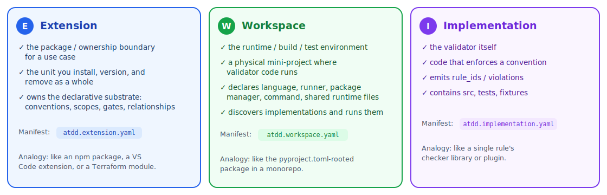
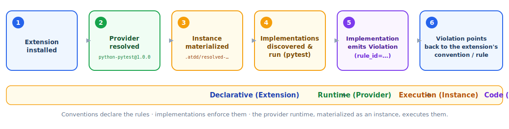
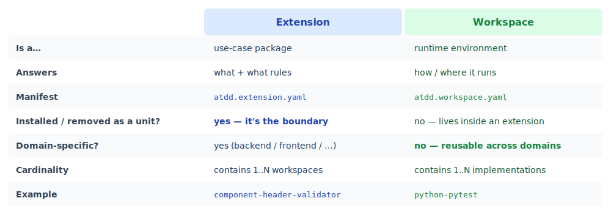

# ATDD Extensions

This repository hosts the official ATDD extension hub.

It contains:

- official ATDD extensions
- extension templates
- a curated registry of known ATDD extensions
- examples for extension authors

## Repository Roles

The core [`atdd`](https://github.com/afokapu/atdd) repository defines the ATDD protocol, schemas, lifecycle machinery, validator runner, graph composition, and `atdd author`.

This `atdd-extensions` repository contains extension packages and extension ecosystem metadata.

```text
atdd            = protocol core (the engine)
atdd-extensions = extension hub (this repo)
```

## Extension Model

An ATDD extension is a self-contained use-case package.

An extension may own:

- conventions
- relationships
- validators
- schemas
- gates
- scopes
- selectors
- tests
- fixtures
- runtime files
- e2e checks

The extension manifest is the ownership boundary:

```text
atdd.extension.yaml
```

## Extension vs Workspace vs Implementation

> **Extension** = the use-case package. **Workspace** = the runtime box. **Implementation** = the code that enforces the rule.

### The big picture — three nested layers



### Worked example: `component-header-validator`

The use case *"source files must declare a component header"* is **one extension**. It owns the rule (declaratively) and contains a workspace, which contains the validator implementation:

```text
acme.extension.component-header-validator/        # EXTENSION (the use case, the package)
  atdd.extension.yaml                             #   ownership boundary + dependencies
  conventions/
    coder.source.component-header-required.convention.yaml   # the RULE (declarative)
  scopes/      # which files this applies to
  gates/       # when it runs (pre-push, ci)
  validators/
    workspaces/
      python-pytest/                              # WORKSPACE (the runtime)
        atdd.workspace.yaml                       #   language=python, runner=pytest, command=pytest
        runtime/   pyproject.toml, pytest.ini, requirements-dev.txt
        coder/validate-source-surface/component-header/
          atdd.implementation.yaml                # IMPLEMENTATION (the actual validator)
          src/      # the Python checker code
          tests/
          fixtures/
```

### What each layer does



### Runtime flow — from install to violation



### Where extension and workspace differ



**Key takeaway:** an **extension** is a *specific, owned, installable use case*; a **workspace** is a *reusable, domain-agnostic runtime* that lives inside an extension. That is also why a runtime like `python-pytest` carries no domain — `backend` / `frontend` / `infrastructure` belongs to the use-case extension, not to the workspace.

**Open design question (not yet decided):** since a runtime like `python-pytest` is meant to be shared by many extensions, should workspaces stay *inside* extensions, or become first-class units referenced across extensions?

- **(a)** a foundational extension ships the workspace and others depend on it, or
- **(b)** workspaces become first-class and are referenced across extensions.

## Namespace Convention

Extension IDs use:

```text
<publisher>.<scope>.<artifact-name>
```

where `scope` is `core | extension`. Examples:

```text
atdd.extension.python-pytest
atdd.extension.component-header-validator
publisher-name.extension.opentofu-backend-policy
publisher-name.extension.github-pr-lifecycle
```

The `atdd` namespace is reserved for official, ATDD-governed artifacts.

## Directory Layout

```text
templates/   Extension templates for authors.
official/    Official ATDD-governed extensions.
registry/    Curated list of official and known external extensions.
examples/    Example extensions for learning and testing.
```

## Creating an Extension

Use the template in `templates/extension/`, or scaffold one with the core CLI:

```bash
atdd author extension init \
  --extension publisher-name.extension.my-extension \
  --flow-wagon validate-source-surface \
  --feature my-feature \
  --role coder
```

## Installing Extensions

Consumer repos install extensions into:

```text
.atdd/extensions/<extension-id>/<version>/
```

Installed extensions remain self-contained. They must not scatter files into ATDD core folders.
