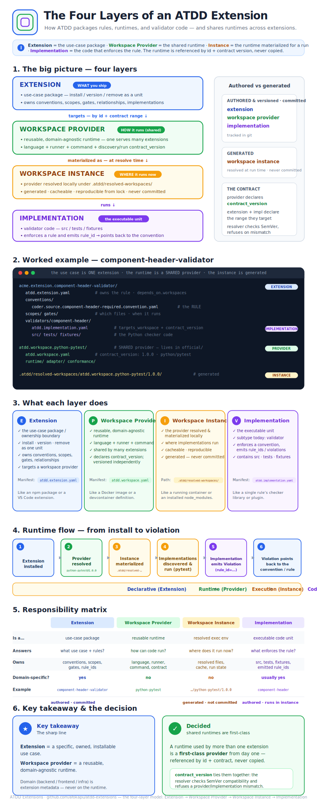
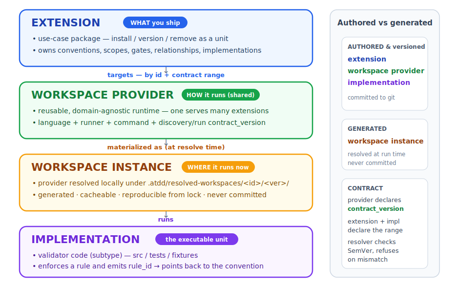
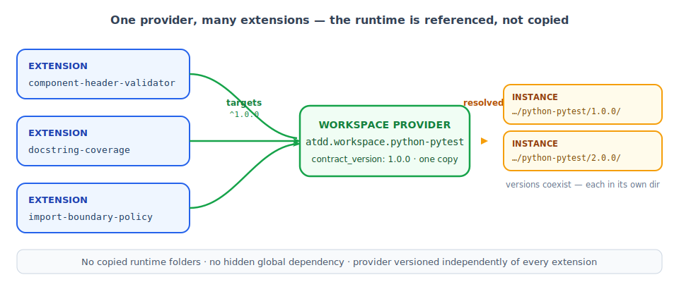
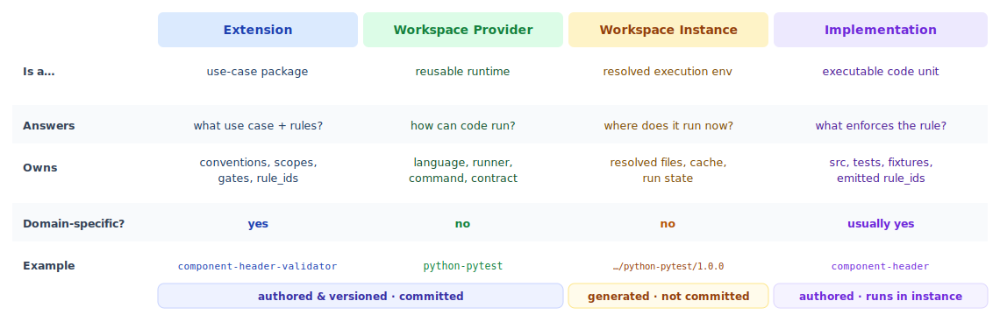

# ATDD Extensions

> 📊 **One-page poster:** [The Four Layers of an ATDD Extension](poster.svg) — a visual explainer for how ATDD packages rules, runtimes, and validator code (great for visual learners).

[](poster.svg)

This repository hosts the official ATDD extension hub.

It contains:

- official ATDD extensions
- official workspace providers (reusable runtimes)
- extension and workspace templates
- a curated registry of known ATDD artifacts
- examples for extension authors

## Repository Roles

The core [`atdd`](https://github.com/afokapu/atdd) repository defines the ATDD protocol, schemas, lifecycle machinery, validator runner, graph composition, and `atdd author`.

This `atdd-extensions` repository contains extension packages, workspace providers, and extension ecosystem metadata.

```text
atdd            = protocol core (the engine)
atdd-extensions = extension hub (this repo)
```

## Extension Model

An ATDD extension is a self-contained use-case package.

An extension may own:

- conventions
- relationships
- implementations (validator code)
- schemas
- gates
- scopes
- selectors
- tests
- fixtures
- e2e checks

An extension does **not** own its runtime. It *targets* a shared **workspace
provider** (see below). The extension manifest is the ownership boundary:

```text
atdd.extension.yaml
```

## The Four Layers

> **Extension** = the use-case package (the *what*). **Workspace provider** = a
> reusable runtime (the *how*). **Workspace instance** = the runtime materialized
> for a run (the *where*). **Implementation** = the code that enforces the rule.

This is the decided model. The earlier "is a workspace nested inside an
extension?" question is resolved: shared runtimes are **first-class providers**,
referenced by id + contract version. Embedding a runtime inside an extension
remains a legal escape hatch for private/experimental runtimes only.



### Why first-class providers

A runtime like `python-pytest` is meant to be shared by many extensions. Making
it a provider — rather than copying it into each extension — keeps one runtime
serving all of them, versioned independently, with no duplicated folders:



### What each layer does


### Runtime flow — from install to violation


### Responsibility matrix



### Worked example: `component-header-validator`

The use case *"source files must declare a component header"* is **one
extension**. It owns the rule and the validator implementation, and **targets**
the shared `atdd.workspace.python-pytest` provider — it does not contain the
runtime. (Full example: [`examples/component-header-validator/`](examples/component-header-validator/).)

```text
acme.extension.component-header-validator/        # EXTENSION (the use case)
  atdd.extension.yaml                             #   owns the rule; depends_on.workspaces: python-pytest ^1.0.0
  conventions/
    coder.source.component-header-required.convention.yaml   # the RULE (declarative)
  scopes/      # which files this applies to
  gates/       # when it runs (pre-push, ci)
  validators/
    component-header/
      atdd.implementation.yaml                    # IMPLEMENTATION — targets_workspace + contract_version
      src/      # the Python checker code
      tests/
      fixtures/

atdd.workspace.python-pytest/                     # WORKSPACE PROVIDER (shared, in official/)
  atdd.workspace.yaml                             #   contract_version: 1.0.0; runtime: python/pytest
  runtime/   adapter/   conformance/

.atdd/resolved-workspaces/                        # WORKSPACE INSTANCES (generated, never committed)
  atdd.workspace.python-pytest/1.0.0/
```

### The provider ↔ implementation contract

The seam that makes this safe is a **versioned contract** between a provider and
the implementations that run inside it:

- a provider declares `contract_version` (e.g. `1.0.0`);
- an extension declares the range it needs (`depends_on.workspaces[].contract: "^1.0.0"`);
- each implementation declares the `contract_version` it satisfies;
- the resolver checks SemVer compatibility and refuses on mismatch.

Bump a provider's MAJOR only when its discovery/run contract changes
incompatibly. A new runtime (`node-vitest`, `go-test`) proves it offers the same
contract by passing the provider's `conformance/` suite.

### Practices

- **Definition vs instance.** Providers are authored, versioned, and committed.
  Instances are materialized at resolve time, cacheable, reproducible from lock
  state, and **never committed** (`.atdd/resolved-workspaces/` is git-ignored).
- **Default to shared, embed only as an escape hatch.** Any runtime used by more
  than one extension is a provider from day one. A private/experimental runtime
  may live inside one extension under `validators/workspaces/<name>/`; promote it
  before a second extension needs it.
- **Multiple provider versions coexist.** Two extensions can target
  `python-pytest@1` and `@2` in the same repo — each version resolves into its
  own instance directory.

**Key takeaway:** an **extension** is a *specific, owned, installable use case*;
a **workspace provider** is a *reusable, domain-agnostic runtime*. Domain
(`backend` / `frontend` / `infrastructure`) is extension metadata — it belongs to
the use case, never to the runtime.

## Namespace Convention

Artifact IDs use:

```text
<publisher>.<scope>.<artifact-name>
```

where `scope` is `core | extension | workspace`:

| scope | meaning | example |
|-------|---------|---------|
| `core` | the ATDD protocol itself | `atdd.core.workspace-schema` |
| `extension` | a use-case package | `acme.extension.component-header-validator` |
| `workspace` | a reusable runtime provider | `atdd.workspace.python-pytest` |

The `atdd` namespace is reserved for official, ATDD-governed artifacts (validated
by `atdd author`'s namespace guard for both extension and workspace ids).

## Directory Layout

```text
templates/   Extension and workspace-provider templates for authors.
official/    Official ATDD-governed artifacts (extensions and workspace providers).
registry/    Curated list of official and known artifacts.
examples/    Example artifacts for learning and testing.
```

## Creating an Extension

Use the template in `templates/extension/`, or scaffold one with the core CLI:

```bash
atdd author extension init \
  --extension publisher-name.extension.my-extension \
  --flow-wagon validate-source-surface \
  --feature my-feature \
  --role coder
```

## Authoring a Workspace Provider

Use the template in `templates/workspace/`. A provider is an authored package
(like an official extension); its id uses the `workspace` scope, e.g.
`publisher-name.workspace.my-runtime`. Keep runtime machinery only — no
conventions, scopes, gates, or domain semantics.

## Installing Extensions

Consumer repos install extensions into:

```text
.atdd/extensions/<extension-id>/<version>/
```

Workspace providers an extension targets are resolved and materialized into:

```text
.atdd/resolved-workspaces/<workspace-id>/<version>/
```

Installed extensions remain self-contained. They must not scatter files into
ATDD core folders. Resolved workspace instances are generated, never committed.
